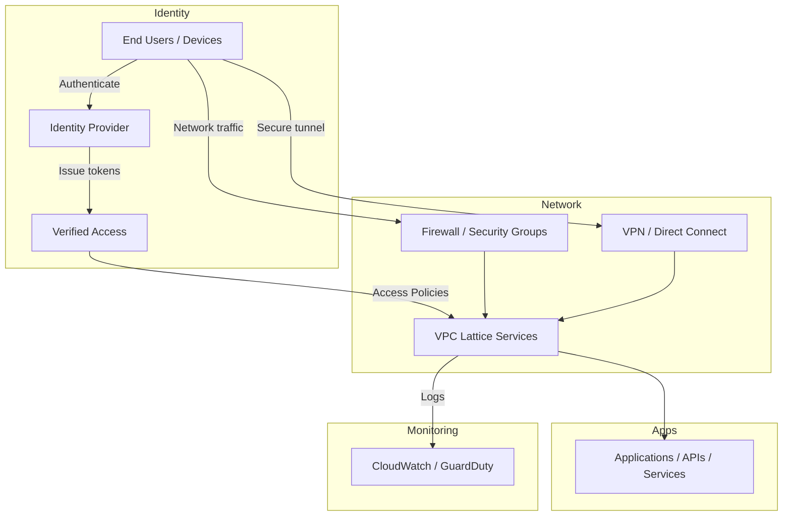

# Zero Trust Cloud Network in AWS  
Securely integrate Zero Trust principles into your AWS cloud network using Amazon VPC Lattice, AWS Verified Access, identity providers, and traditional network security controls.  

## 📝 Overview  
This project demonstrates how to adopt Zero Trust alongside traditional network security functions in AWS, using:  
- **Amazon VPC Lattice** – to build application-layer networking across VPCs and accounts while enforcing fine‑grained access controls.  
- **AWS Verified Access** – to provide secure, VPN‑less connectivity to applications using identity‑aware policies.  
- **Identity providers and IAM** – to continuously authenticate users and devices based on identity, device posture, and context.  
- **Traditional network controls** – such as firewalls and VPNs for baseline protections and segmentation.  

It showcases how identity‑centric access and network‑layer controls can be combined to create a secure, modern cloud network architecture following Zero Trust principles.  

## 🗗️ Architecture  
<details>  
<summary>Click to view high‑level architecture diagram (mermaid)</summary>  


</details>  

## 📁 Repository Structure  
```  
zero-trust-cloud-network/  
├── README.md                # Project overview and instructions  
├── docs/                    # Additional documentation and diagrams  
│   ├── architecture.png     # Exported architecture diagram  
│   └── zero-trust-notes.md  # Notes from AWS re:Inforce session  
└── src/                     # Example configuration and scripts  
    ├── vpc-lattice/         # Sample VPC Lattice config templates  
    └── verified-access/     # Sample Verified Access policy definitions  
```  

## 🦜 Branches  
- `main` – stable branch containing the production-ready version of the project.  
- `dev` – development branch for new features and updates before merging into `main`.  

## 🧠 Prerequisites  
- An AWS account with permissions to create VPCs, VPC Lattice services, and Verified Access instances.  
- AWS CLI installed and configured with appropriate credentials.  
- Node.js or Python installed if you wish to run sample scripts.  
- [Terraform](https://www.terraform.io/) or [AWS CloudFormation](https://aws.amazon.com/cloudformation/) if using provided templates.  
- An identity provider (e.g., AWS IAM Identity Center, Okta) configured for AWS Verified Access.  
- Basic understanding of AWS networking concepts (VPCs, subnets, security groups).  

## 🚀 Getting Started  
Follow these steps to experiment with building a Zero Trust cloud network:  

1. **Clone the repository**  
   ```bash  
   git clone https://github.com/xaviermotley/zero-trust-cloud-network.git  
   cd zero-trust-cloud-network  
   ```  

2. **Review session notes**  
   Read through `docs/zero-trust-notes.md` summarizing key takeaways from the AWS re:Inforce 2025 session on Zero Trust.  

3. **Deploy base network**  
   Use the templates in `src/vpc-lattice` to deploy a simple VPC and VPC Lattice service. You can adapt the provided CloudFormation or Terraform scripts to match your environment.  

4. **Configure Verified Access**  
   Follow the examples in `src/verified-access` to create a Verified Access instance, connect it to your identity provider, and define policies controlling access based on user identity and device posture.  

5. **Integrate traditional controls**  
   Update security groups, network ACLs, firewalls, and VPN configurations to provide baseline network protections. Use AWS Network Firewall or third‑party firewalls if needed.  

6. **Test Zero Trust access**  
   Attempt to access your applications from various user identities and device contexts. Validate that access is granted only when policies match and that unauthorized attempts are denied and logged.  

7. **Monitor and iterate**  
   Enable logging and monitoring using Amazon CloudWatch, AWS CloudTrail, and Amazon GuardDuty. Review logs to continuously improve your policies and network posture.  

## 🍟 Cleanup  
When finished experimenting, remember to clean up resources to avoid unnecessary charges:  
- Delete Verified Access instances.  
- Remove VPC Lattice services and any associated target groups.  
- Tear down VPCs, subnets, and any resources created via templates.  

## 💄 License  
This project is licensed under the MIT License. See the [LICENSE](LICENSE) file for details. 
