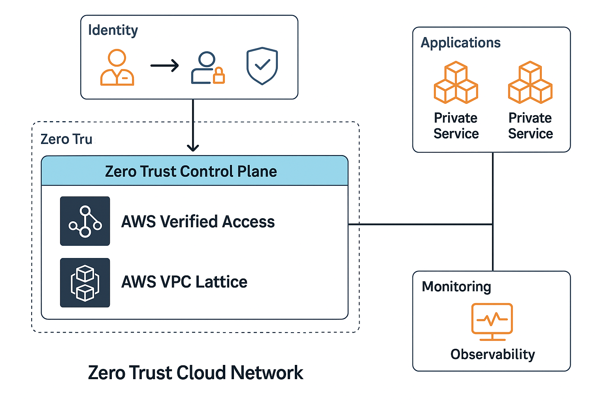
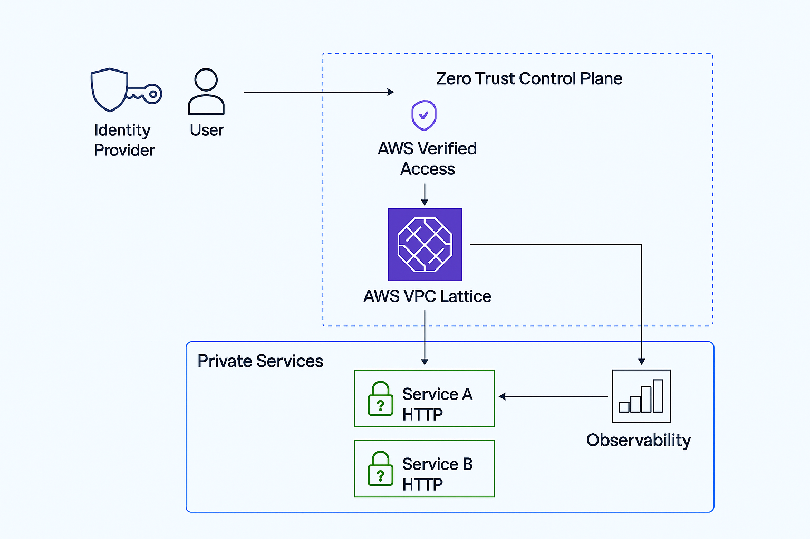

# Zero Trust Cloud Network in AWS  

Securely integrate Zero Trust principles into your AWS cloud network using Amazon VPC Lattice, AWS Verified Access, identity providers, and traditional network security controls.  

## 📝 Overview  

This project demonstrates how to adopt Zero Trust alongside traditional network security functions in AWS, using:  
- Amazon VPC Lattice – to build application‑layer networking across VPCs and accounts while enforcing fine‑grained access controls.  
- AWS Verified Access – to provide secure, VPN‑less connectivity to applications using identity‑aware policies.  
- Identity providers and IAM – to continuously authenticate users and devices based on identity, device posture, and context.  
- Traditional network controls – such as firewalls and VPNs for baseline protections and segmentation.  

It showcases how identity‑centric access and network‑layer controls can be combined to create a secure, modern cloud network architecture following Zero Trust principles.  

## 🛍️ Architecture  

This project demonstrates an end‑to‑end Zero Trust cloud network built with AWS services. It integrates identity‑aware access (AWS Verified Access), service‑to‑service security (VPC Lattice), and observability (CloudWatch / SIEM) under a Zero Trust model.  

---  

### 🔹 High‑Level Diagram  

<p align="center">
  
</p>

---  

### 🔹 Detailed Network Flow  

<p align="center">
  
</p>

---  

Each diagram illustrates a different layer of the architecture:  

| Layer | Focus |  
|-------|-------|  
| Identity | Continuous authentication and policy issuance via AWS Verified Access and your IdP |  
| Network  | Secure traffic segmentation through VPC Lattice and network firewalls |  
| Applications | Access‑controlled workloads and private services |  
| Observability | CloudWatch, GuardDuty, and SIEM correlation for visibility and threat detection |  

## 📂 Repository Structure  

```
.
├── docs/
│   └── zero-trust-notes.md               # Session notes and guidance
├── src/
│   ├── vpc-lattice/
│   │   ├── README.md                     # Overview of VPC Lattice sample configs
│   │   └── sample-service-network.yaml   # Example VPC Lattice service network definition
│   └── verified-access/
│       └── sample-policy.json            # Sample AWS Verified Access policy
├── diagram.png                           # High-level architecture diagram
├── 07c7391f-e679-4680-988d-921a1d7c1dd5.png  # Zero Trust control plane diagram
├── 0228949305.png                        # Detailed network flow diagram
└── README.md                             # Main documentation (this file)
```

## 🌳 Branches  

This repository follows a simple Git flow:  

- **main** – stable branch with working instructions and diagrams.  
- **feature/*** – branches for enhancements or experiments before merging back to `main`.  

## 📺 Prerequisites  

Before deploying the sample configs, ensure you have:  

- An AWS account with permissions to create VPCs, VPC Lattice service networks, and Verified Access instances.  
- AWS CLI installed and configured with appropriate credentials.  
- Terraform (optional) if you wish to codify deployments.  

## 🚀 Getting Started  

1. Clone this repository to your local machine.  
2. Review the diagrams in the Architecture section to understand how components interact.  
3. Navigate to `src/vpc-lattice` and inspect the `sample-service-network.yaml` file to deploy a VPC Lattice service network.  
4. Navigate to `src/verified-access` and inspect `sample-policy.json` to set up your Verified Access policies.  
5. Refer to `docs/zero-trust-notes.md` for detailed guidance on applying Zero Trust principles in AWS.  

## 🪑 Cleanup  

To clean up resources provisioned from these samples, delete any VPC Lattice service networks and Verified Access instances you created through the AWS Console or CLI.  

## 📝 License  

This project is licensed under the [MIT License](LICENSE). 
